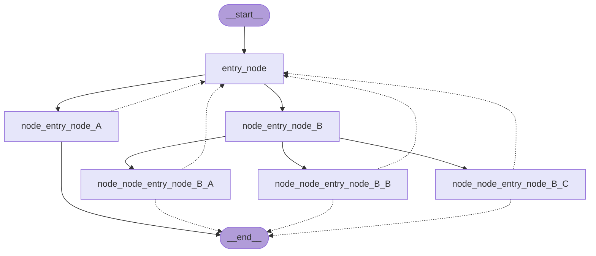

# How to visualize your graph

Table of contents

- [Setup](https://langchain-ai.github.io/langgraph/how-tos/visualization/#setup)
- [Set up Graph](https://langchain-ai.github.io/langgraph/how-tos/visualization/#set-up-graph)
- [Mermaid](https://langchain-ai.github.io/langgraph/how-tos/visualization/#mermaid)
- [PNG](https://langchain-ai.github.io/langgraph/how-tos/visualization/#png)

  - [Using Mermaid.Ink](https://langchain-ai.github.io/langgraph/how-tos/visualization/#using-mermaidink)
  - [Using Mermaid + Pyppeteer](https://langchain-ai.github.io/langgraph/how-tos/visualization/#using-mermaid-pyppeteer)
  - [Using Graphviz](https://langchain-ai.github.io/langgraph/how-tos/visualization/#using-graphviz)

1.  [Home](https://langchain-ai.github.io/langgraph/)
2.  [Guides](https://langchain-ai.github.io/langgraph/how-tos/)
3.  [How-to Guides](https://langchain-ai.github.io/langgraph/how-tos/)
4.  [LangGraph](https://langchain-ai.github.io/langgraph/how-tos#langgraph)
5.  [Graph API Basics](https://langchain-ai.github.io/langgraph/how-tos#graph-api-basics)

# How to visualize your graph[¶](https://langchain-ai.github.io/langgraph/how-tos/visualization/#how-to-visualize-your-graph "Permanent link")

This guide walks through how to visualize the graphs you create. This works with ANY [Graph](https://langchain-ai.github.io/langgraph/reference/graphs/).

## Setup[¶](https://langchain-ai.github.io/langgraph/how-tos/visualization/#setup "Permanent link")

First, let's install the required packages

`%%capture --no-stderr %pip install -U langgraph`

## Set up Graph[¶](https://langchain-ai.github.io/langgraph/how-tos/visualization/#set-up-graph "Permanent link")

You can visualize any arbitrary [Graph](https://langchain-ai.github.io/langgraph/reference/graphs/), including [StateGraph](https://langchain-ai.github.io/langgraph/reference/graphs/#langgraph.graph.state.StateGraph). Let's have some fun by drawing fractals :).

`import random from typing import Annotated, Literal from typing_extensions import TypedDict from langgraph.graph import StateGraph, START, END from langgraph.graph.message import add_messages  class State(TypedDict):         messages: Annotated[list, add_messages]  class MyNode:         def __init__(self, name: str):                self.name = name         def __call__(self, state: State):                return {"messages": [("assistant", f"Called node {self.name}")]}  def route(state) -> Literal["entry_node", "__end__"]:         if len(state["messages"]) > 10:                return "__end__"        return "entry_node"  def add_fractal_nodes(builder, current_node, level, max_level):         if level > max_level:                return         # Number of nodes to create at this level        num_nodes = random.randint(1, 3)  # Adjust randomness as needed        for i in range(num_nodes):                nm = ["A", "B", "C"][i]                node_name = f"node_{current_node}_{nm}"                builder.add_node(node_name, MyNode(node_name))                builder.add_edge(current_node, node_name)                 # Recursively add more nodes                r = random.random()                if r > 0.2 and level + 1 < max_level:                        add_fractal_nodes(builder, node_name, level + 1, max_level)                elif r > 0.05:                        builder.add_conditional_edges(node_name, route, node_name)                else:                        # End                        builder.add_edge(node_name, "__end__")  def build_fractal_graph(max_level: int):         builder = StateGraph(State)        entry_point = "entry_node"        builder.add_node(entry_point, MyNode(entry_point))        builder.add_edge(START, entry_point)         add_fractal_nodes(builder, entry_point, 1, max_level)         # Optional: set a finish point if required        builder.add_edge(entry_point, END)  # or any specific node         return builder.compile()  app = build_fractal_graph(3)`

API Reference: [StateGraph](https://langchain-ai.github.io/langgraph/reference/graphs/#langgraph.graph.state.StateGraph) | [START](https://langchain-ai.github.io/langgraph/reference/constants/#langgraph.constants.START) | [END](https://langchain-ai.github.io/langgraph/reference/constants/#langgraph.constants.END) | [add_messages](https://langchain-ai.github.io/langgraph/reference/graphs/#langgraph.graph.message.add_messages)

## Mermaid[¶](https://langchain-ai.github.io/langgraph/how-tos/visualization/#mermaid "Permanent link")

We can also convert a graph class into Mermaid syntax.

`print(app.get_graph().draw_mermaid())`

`%%{init: {'flowchart': {'curve': 'linear'}}}%% graph TD;         __start__([
__start__
]):::first        entry_node(entry_node)        node_entry_node_A(node_entry_node_A)        node_entry_node_B(node_entry_node_B)        node_node_entry_node_B_A(node_node_entry_node_B_A)        node_node_entry_node_B_B(node_node_entry_node_B_B)        node_node_entry_node_B_C(node_node_entry_node_B_C)        __end__([
__end__
]):::last        __start__ --> entry_node;        entry_node --> __end__;        entry_node --> node_entry_node_A;        entry_node --> node_entry_node_B;        node_entry_node_B --> node_node_entry_node_B_A;        node_entry_node_B --> node_node_entry_node_B_B;        node_entry_node_B --> node_node_entry_node_B_C;        node_entry_node_A -.-> entry_node;        node_entry_node_A -.-> __end__;        node_node_entry_node_B_A -.-> entry_node;        node_node_entry_node_B_A -.-> __end__;        node_node_entry_node_B_B -.-> entry_node;        node_node_entry_node_B_B -.-> __end__;        node_node_entry_node_B_C -.-> entry_node;        node_node_entry_node_B_C -.-> __end__;        classDef default fill:#f2f0ff,line-height:1.2        classDef first fill-opacity:0        classDef last fill:#bfb6fc`

## PNG[¶](https://langchain-ai.github.io/langgraph/how-tos/visualization/#png "Permanent link")

If preferred, we could render the Graph into a `.png`. Here we could use three options:

- Using Mermaid.ink API (does not require additional packages)
- Using Mermaid + Pyppeteer (requires `pip install pyppeteer`)
- Using graphviz (which requires `pip install graphviz`)

### Using Mermaid.Ink[¶](https://langchain-ai.github.io/langgraph/how-tos/visualization/#using-mermaidink "Permanent link")

By default, `draw_mermaid_png()` uses Mermaid.Ink's API to generate the diagram.

`from IPython.display import Image, display from langchain_core.runnables.graph import CurveStyle, MermaidDrawMethod, NodeStyles display(         Image(                app.get_graph().draw_mermaid_png(                        draw_method=MermaidDrawMethod.API,                )        ) )`

API Reference: [CurveStyle](https://python.langchain.com/api_reference/core/runnables/langchain_core.runnables.graph.CurveStyle.html) | [MermaidDrawMethod](https://python.langchain.com/api_reference/core/runnables/langchain_core.runnables.graph.MermaidDrawMethod.html) | [NodeStyles](https://python.langchain.com/api_reference/core/runnables/langchain_core.runnables.graph.NodeStyles.html)

The visual of the graph will be rendered as a visual and the code of it would look something like this:

### Using Mermaid + Pyppeteer[¶](https://langchain-ai.github.io/langgraph/how-tos/visualization/#using-mermaid-pyppeteer "Permanent link")

`%%capture --no-stderr %pip install --quiet pyppeteer %pip install --quiet nest_asyncio`

`import nest_asyncio nest_asyncio.apply()  # Required for Jupyter Notebook to run async functions display(         Image(                app.get_graph().draw_mermaid_png(                        curve_style=CurveStyle.LINEAR,                        node_colors=NodeStyles(first="#ffdfba", last="#baffc9", default="#fad7de"),                        wrap_label_n_words=9,                        output_file_path=None,                        draw_method=MermaidDrawMethod.PYPPETEER,                        background_color="white",                        padding=10,                )        ) )`

### Using Graphviz[¶](https://langchain-ai.github.io/langgraph/how-tos/visualization/#using-graphviz "Permanent link")

`%%capture --no-stderr %pip install pygraphviz`

`try:         display(Image(app.get_graph().draw_png())) except ImportError:         print(                "You likely need to install dependencies for pygraphviz, see more here https://github.com/pygraphviz/pygraphviz/blob/main/INSTALL.txt"        )`
